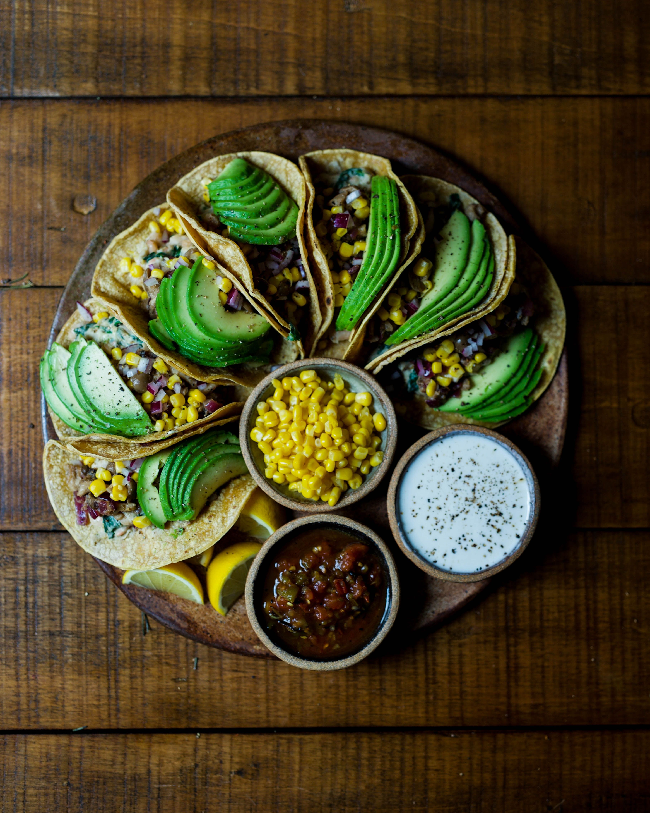
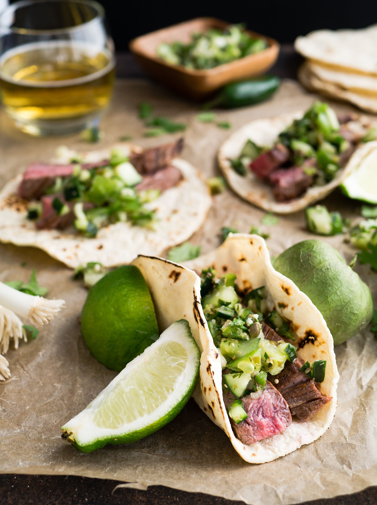

<aside class="hightlight_warn">
🔖 The process of bringing an idea into a product
</aside>

Together, critic Jonathan Gold, food scholar Evan Kleiman, and chefs Ray Garcia, Bricia Lopez, and Carlos Salgado have spent more than a lifetime preparing, eating, and writing about Latin American cuisine. Before their recent [panel discussion](http://www.getty.edu/visit/cal/events/ev_2035.html) at the Getty, offered in conjunction with Pacific Standard Time, they sat down with us to reflect on the role of Mexican cuisine in the life of Los Angeles and how we might expand our taste buds to go deeper.

**`SS`: As a chef (or critic), do you consider yourself an artist?**

**`EK`:** Art to me often has an intellectual component. I think of food preparation as a craft–I don’t think of it as art.

**`RG`:** My personal approach to food is more of a craftsman. I like having my tools in hand, sort of creating and building, and my approach is much more trial and error. It’s part social scientist, and part repair person or builder. I put food out, and wait for the reaction, and see what we can push, what we can improve.

In the Getty Center auditorium for the recent “There Will Be Food“ panel.

**`JG`:** I’m a writer. Some people can call writers artists, some people cannot. In terms of food, there are people who approach cuisine from an art angle. Carlos Salgado is astonishing that way. His food is rooted in Mexican flavors, but there’s this level of abstraction in his food. Is it art as opposed to food? No, it’s food, but it’s being approached in a different way.

**`CS`:** The highest point in my life is being with close family and friends, in the backyard over a fire, cooking over the course of many hours, sitting under the sky, and just filling this space with so much warmth. When I’m cooking there, I feel much more like an artist than when I worked in the highest-concept restaurants. They are like museums of food, accessible only with a certain level of literacy on the part of the diner, with a certain level of cultural experience and background.

Tamale with pepitas at Taco María in Costa Mesa

**`SS`: This panel represents Mexican American cuisine in LA. What other kinds of Latin American cuisine or particular dishes from other regions do you like?**

**`JG`:** El Salvadoreño cooking. It’s very basic, but the ways they use corn and greens and cheese. The fermentations are lovely.

**`EK`:** I love Guatemalan tamales, maybe more than Mexican tamales. The masa is often mixed with potato, so it’s much more tender. They’re wrapped in banana leaves, so there’s a different flavor. And the way they are filled is different; often there’s olives or raisins or prunes in them.

**`BL`:** I love Peruvian food. Everything from the ceviche to rice and beans, all of the flavors. It has so much depth.

**`CS`:** Baja coastal cuisine. The freshness of it–you eat seafood in the morning because it just came in. Very simply prepared, very intense, briny ocean flavors: big clams, oysters, shrimp. Big, big flavors.

**`SS`: If you could recommend one dish or element in Mexican-American cuisine that a total beginner must try, what would it be?**

**`EK`:** Tacos, because anything you eat with your hands is less intimidating than something that requires silverware. It takes you back to the permission of childhood, and that joy of just eating that is super direct. There is nothing in between you and the food.

**`BL`:** I think mole is a really good one. A lot of people think of it as a chocolate sauce, and yes, it has chocolate, but it also has like 18 other things. I always recommend three things: mole, the barbacoa, and the chiles rellenos at my restaurant, just because I think they are universally delicious.

Dishes at Broken Spanish, in Downtown LA.

**`CS`:** I would say try more and different types of chilies, and the salsas that result from them. The range of flavors, and balance of flavors, is really exciting, and is my favorite part of Mexican food.

**`RG`:** Put aside your thoughts and limitations on what Mexican food can be, and how much it can cost. Especially in LA, there is almost a cult-like following for cheap Mexican food, for the greasy taco truck. There is something people find exciting about that, but I think it’s good to stop and wonder why your taco costs a dollar. There must be a lot behind it that allows you to eat a dollar taco. It probably doesn’t include a living wage, a safe work environment, or the best quality ingredients for you and your body. We could understand where our food is coming from and be a bit more conscious in our choices.

**Source**: [Food Icons on the Evolving Role of Mexican Cuisine in LA](http://blogs.getty.edu/iris/5-food-icons-on-the-evolving-role-of-mexican-cuisine-in-la/)